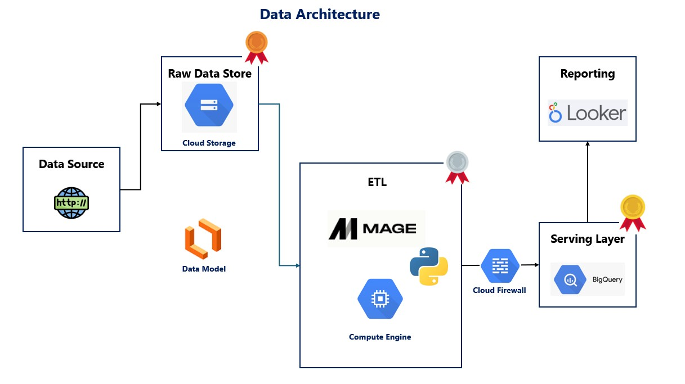

# Azure-Data-Engineering-Project
## Introduction
This project demonstrates a complete, production-style data engineering workflow built entirely on **Google Cloud Platform (GCP)**.

The pipeline architecture includes:

- **Data Ingestion**: Raw datasets uploaded and stored in Google Cloud Storage (GCS)

- **ETL Orchestration**: Data transformation and pipeline execution using Mage deployed on Google Compute Engine

- **Data Modeling**: Dimensional models designed and documented using Lucidchart

- **Analytics Storage Layer**: Processed data loaded into Google BigQuery for scalable analytics

- **Access Control & Security**: Infrastructure secured using Google Cloud Firewall rules and IAM role-based permissions

- **Data Visualization**: Business intelligence dashboards built in Looker

This repository reflects an end-to-end cloud-native data workflow - from ingestion and transformation to analytics and visualization—following modern data engineering best practices.

## Data Architecture

## Technology Used

1. Programming Language - Python
2. Scripting Langugae - Google BigQuery (SQL)
3. Google Cloud Storage
4. Google Compute Engine
5. Mage AI
6. Google Could Firewall
7. Looker Studio
8. Lucidchart

## Dataset Used

[https://github.com/sriraja33/Azure-Data-Engineering-Project/tree/main/Project%20Data](https://github.com/sriraja33/GCP-End-to-End-Project/blob/main/Data/uber_data.csv)

## Data Model

## Scripts for the Project

1) [Extract](https://github.com/sriraja33/GCP-End-to-End-Project/blob/main/Mage_Files/Extract.ipynb)
2) [Transform](https://github.com/sriraja33/GCP-End-to-End-Project/blob/main/Mage_Files/Transform.ipynb)
3) [Load](https://github.com/sriraja33/GCP-End-to-End-Project/blob/main/Mage_Files/Load.ipynb)
